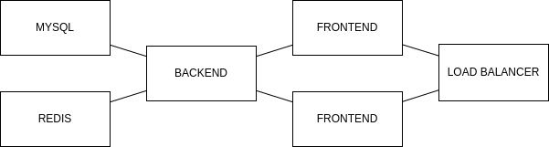

# Ideia inicial
A tarefa define que deve se partir de um app já existente e disponibilizar em um ambiente simulado de produção.

Dividida em duas partes, a primeira tem o objetivo de preparar a aplicação para produção. Já a segunda tem o objetivo de colocar esta aplicação em produção.

Então, a primeira ideia é executar esta aplicação de forma local e verificar se está minimamente pronta para promover a um ambiente de produção. Passada esta etapa, construir o deploy com o minikube.

# Parte 1
## Desenvolvimento
Embora seja possível executar os serviços de forma direta na máquina local, por uma questão de consistência do ambiente de desenvolvimento, facilidade e agilidade de criação, além de já se tratar do primeiro estágio de uma esteira de CI/CD, optei por usar os serviços em docker e executar em desenvolvimento por docker compose. [Commit f89e06b8]

Usando uma abordagem 'as is', sem me preocupar neste momento em fazer alterações no código, pra criar o arquivo `.env` é preciso saber quais envvars a aplicação usa. Focando inicialmente no backend a documentação indica as envs `PORT`, `DB` e `REDIS_URL`. Porém, uma simples análise do código mostra que na `linha 33` do arquivo `app.go` a envvar usada é `DATABASE_URL`.

Um ponto que chama atenção é o redis  não ter credenciais de acesso, como mostram as `linhas 48 a 52`. Mesmo que se trate de um serviço interno, sem acesso público, as boas práticas de segurança pregam que deve ser usadas credenciais de acesso. Desta forma, em um eventual comprometimento dos serviços ou da infra o escalamento seja dificultado. Esta correção será feita mais tarde, depois que a aplicação esteja rodando e validada.

Com isso o arquivo `.env` já pode ser criado. Importante frizar que este arquivo não deve ser colocado no git devido à criticidade das informações. Idealmente seu conteúdo é consultado de serviços de vault como AWS Parameter Store, Hashicorp Vault e similares. Mas pela simplicidade do exercício vou colocar em um commit unicamente para facilitar a avaliação. [Commit cf29c167]

Agora que temos as envs definidas, podemos criar o dockerfile da aplicação backend. Seguindo a ideia de termos a menor imagem possível, porque reduz o tempo de carga, os dados trafegados e potencialmente o custo da operação, optei por usar um build em múltiplos estágios. Para isso, usei a versão 1.20 do go, conforme a doc e a `linha 3` do arquivo `go.mod`, e uma imagem base distroless para execução da aplicação. Como resultado, a imagem gerada tem o tamanho de 10MB! Por organização, o dockerfile foi colocado no mesmo path da aplicação. [Commit ffa7aa7f]

Para executar a api como backend basta incluir no docker compose. Por facilidade o build é forçado a cada execução. [Commit 3212d8c5]

Agora que temos o backend plenamente funcional, vamos olhar para o frontend. Assim como foi feito para o backend, um container também será usado para o frontend. Conforme o `package.json` na `linha 21`, a versão usada é a `node 22`. As envvars usadas são `PORT` e `API_HOST`. [Commit 3d3eead1]

Da mesma forma, incluímos o frontend no docker compose. Por simplicidade, deixei as envsvars no docker compose. Para colocar como .env precisaria alterar o código para resolver o conflito da env `PORT` com o backend e no momento não faz sentido a troca. [Commit fcbded87]

Executando os serviços o frontend acusou erro na `linha 21` do `app.js`. Como se trata de um erro de compilação, um nome escrito errado, precisei corrigir. [Commit 7878cd9d]

Após a correção o container subiu sem erros mas ao acessar o frontend no navegador a mensagem `error running request to undefined/api/status` foi mostrada. Com uma breve análise do código identificamos que a `linha 6` do arquivo `routes/index.js` tinha um erro. Feita a correção, o frontend funcionou como esperado. [Commit bbb749d7]

# Parte 2
## Deploy
Agora que temos a aplicação funcionando, podemos atacar o deploy no minikube. Porém, antes fiz pequenas mudanças no dockerfile do backend e do frontend para reduzir a quantidade de camadas das imagens condensando os comandos `RUN` e para executar o container com um usuário não root. [Commit 1cfc098a]

Idealmente as envvars seriam configuradas direto na vault do kubernetes, ou em algum serviço similar, e carregadas para o container para garantir segurança. Porém, por simplicidade e para que tudo seja carregado com um único comando, usaremos os arquivos de configuração `app-config.yml` e `mysql-secret.yml`. [Commit 23d31157]

Os volumes para persistência dos datos do redis e mysql precisam ser criados. O arquivo `persistent-volume-claim.yml` define como isso é feito. [Commit 7bb75b5e]

Agora é preciso criar os arquivos de deployment e service para cada um dos serviços. Foram feitas configurações de recursos mínimos, definindo o mínimo necessário, e recursos máximos. Também foram definidos os probes de readiness e liveness para avaliar o estado de cada pod. Por último, o mysql, o redis e o backend foram definidos de forma que não tenham acesso externo enquanto o frontend está por trás de um load ballancer. [Commits e04a8bc3, da32c184, 963df2f9 e 61d61d71];

Para incluirmos o controle de escalamento (HPA) é preciso, antes de tudo, incluir o serviço de coleta de métricas. Porém, como o minikube tem alguns problemas relacionados ao certificado, foi preciso alterar a configuração original do pod para que seja executado sem usar os certificados. O arquivo `frontend-hpa.yml` faz estas configurações. [Commit 753b8bba]

O escalamento do frontend foi feito com a criação do arquivo `frontend-hpa.yml`. [Commit 738eb6fb]

Importante frisar que apenas o frontend recebeu esta configuração porque o escalamento de bancos de dados não pode ser feito de forma meramente horizontal. Isto incorre em problemas de persistência de dados e concorrência. O backend passa por um problema similar. Como não temos uma pool de leitura dos bancos, um processo de escrita poderia cair numa condição de concorrência com outra. Ainda que não ocorra no nosso caso isto não ocorra, este caso precisa ser melhor avaliado.

Pra subir tudo com um único comando, como pedido, foi criado o script `run-app.sh`. O deploy no minikube podia ser feito com um `kubectl apply -k <path>` mas como precisava garantir que as imagens do backend e do frontend já existem no docker do minikube, foi mais simples usar um script bash.  [Commit 03f08ce5]

Basta executar o `run-app.sh`, pegar o endereço da saída, e acessar no browser. O tempo de criação pode levar 10 min ou mais.

# Melhorias
Agora que temos a aplicação up podemos fazer as melhorias, incluindo as mapeadas antes.

A primeira melhoria foi colocar senha para acesso ao redis e, junto com isso, passar a url do mysql e do redis para secret. [Commits e758e1e3 e 193e5d58]

Outra melhoria foi incluir um endpoint `/liveness` ao backend. Isto ajuda a perceber e diferenciar o estado de ativo, que é o serviço up e aceitando conexão, do estado de pronto, que é executando requisições no banco. Com isto, o kubernetes consegue diferenciar os estados e não reinicia o backend de forma desnecessária enquanto o mysql ainda não está pronto. [Commit 78cf261a]

A aplicação foi fornecida sem nenhum tipo de teste feito pelo desenvolvedor. Pela sua natureza precisaria desenvolver os testes unitários, de integração, segurança, etc. Infelizmente por limitação de tempo, não consigo escrever mas deixo indicado que esta etapa é essencial para uma boa esteira de desenvolvimento e entrega.

Também merece especial atenção a comunicação secura com a aplicação. No caso específico não existem credenciais ou outros dados sensíveis sendo trafegados na interação do usuário com o frontend mas mesmo assim é recomendável o uso de certificados para validar autenticidade. 

Da mesma forma é possível avaliar o uso de SSL entre os serviços internos. No caso em tela estão todos no mesmo nó do kubernetes mas em casos onde ocorre tráfego trocado por ambiente de rede inseguro o uso de SSL é imperativo.

Um terceiro ponto de atenção é definir se este backend é de acesso público ou apenas pelo front. Neste sentido, é preciso usar mecanismos de autenticidade para garantir que as informações só sejam trocadas com aplicações devidamente autorizadas. Por exemplo usar SSL, OAUTH, CORS, etc.

# Arquitetura
Como o minikube executa um único nó, todos os pods são executados nele. Então, a arquitetura fica conforme o desenho abaixo dentro de um único nó.

